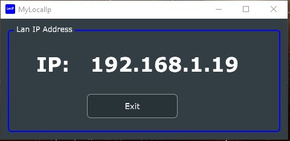

#   Simple LAN Ip Viewer

## Description

This simple utility allows you see what you local IP is on your LAN. 

It uses the JUCE API to get the IP address and then displays it in a window.

It uses a JUCE array to store the addresses and then filters out only the local network address.

This example is based on using a *192.168.1.x* network address.

If you use a different network address, you will need to change the filter in the code.

### Building the code

Use the Projucer to create a project for your IDE of choice. Compile and run the code.
That is all there is to it.

